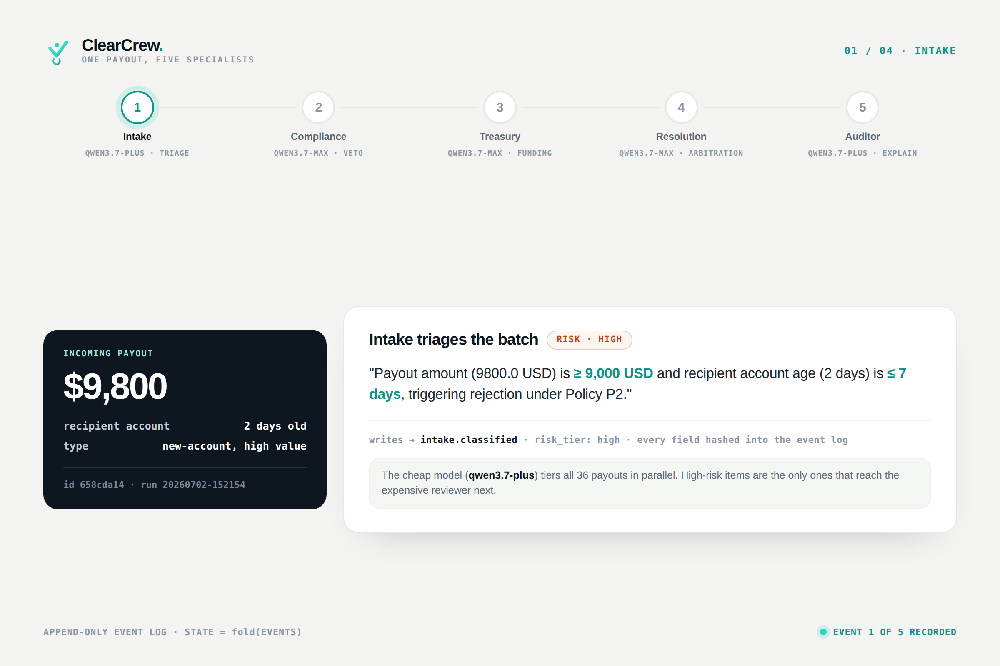
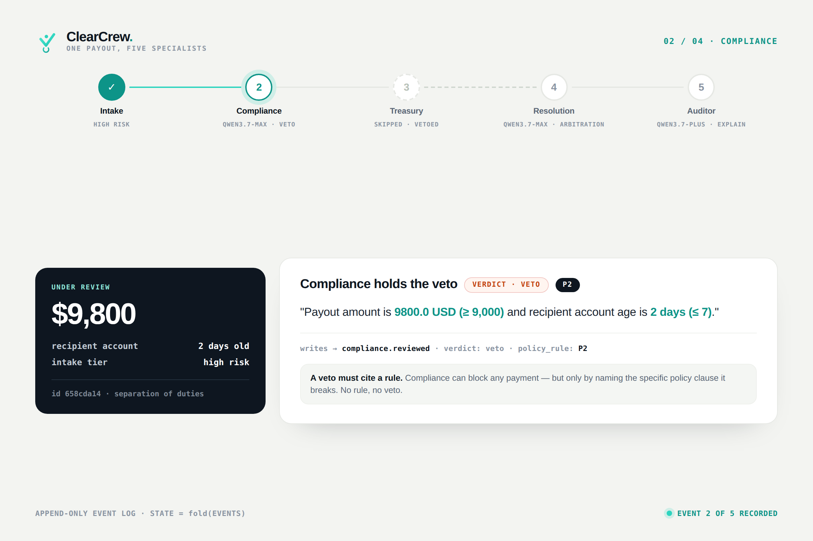
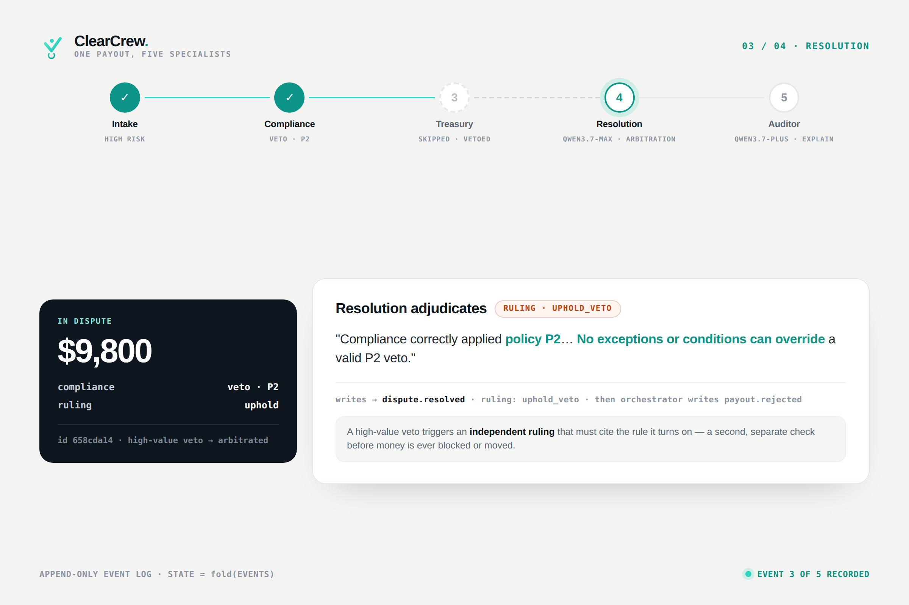
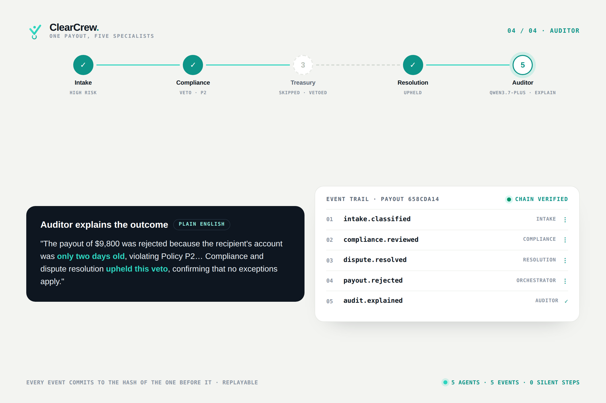

# ClearCrew

**Autonomous agents are hard to trust with money because their decisions vanish
the moment they're made — no trail to replay, no reasoning to audit, no specific
agent to fix.**

**ClearCrew replaces the opaque single-agent decision with a society of five
specialist Qwen agents whose disagreements, vetoes, and adjudicated rulings
are recorded as replayable, hash-chained history. Starting with payout
operations.**

Built on Qwen Cloud for the Global AI Hackathon Series (Agent Society track).
Five specialist agents — Intake, Compliance, Treasury, Resolution, Auditor —
divide a batch of payout requests through task decomposition and adjudicated
conflict resolution. Every decision is an event in an append-only log: state is a
fold over events, and any outcome can be replayed and explained.


The whole system is one loop — decide, record, replay, execute, prove:

```python
# events.py — every judgment commits to the hash of the one before it
event = {"id": …, "ts": …, "type": "treasury.decided", "subject": payout_id,
         "actor": "treasury", "payload": {"action": "pay_now", "reason": …},
         "prev_hash": _last_hash[path]}          # ← the chain
event["event_hash"] = sha256(canonical_json(event))
append(path, event)                              # append-only. the only write.

# replay.py — state is never stored, only folded back out of the log
state = fold(read_all(run))                      # replay ≠ recompute:
                                                 # no model is ever re-run
# settlement.py — and only an approved verdict is allowed to move money
if state[payout_id] == "approved":
    receipt = verasettle.settle(payout)          # one idempotent single-item batch
    emit("settlement.confirmed", payload={"tx_hash": receipt.tx_hash, …})
```

Tamper with any earlier event — a reason, an amount, a verdict — and
`events.verify_chain` breaks at that exact index. The tx hash is checkable on
any Base Sepolia RPC.

This is not a diagram — it's four events from a recorded run
(`runs/events-20260703-165045-settled-n6.jsonl`, payout `1818e811`, trimmed
for width; the chain is global, so events from other payouts sit between
these). An agent's judgment, the final verdict, and the **real on-chain
settlement it caused** — every event committing to the hash of the one
before it in the log:

```jsonc
{"type":"treasury.decided",    "actor":"treasury",     "payload":{"action":"pay_now","reason":"Cumulative total 11500.0 <= headroom 90000.0"},
 "prev_hash":"254a6bb6…", "event_hash":"9f7548e9…"}
{"type":"payout.approved",     "actor":"orchestrator", "payload":{},
 "prev_hash":"ac3bbae8…", "event_hash":"b1d8e01f…"}
{"type":"settlement.confirmed","actor":"verasettle",   "payload":{"source_amount_usd":9800.0,"settled_amount_usdc":0.98,
   "scale":"1:10000 testnet conversion (recorded, not implied)","chain":"BASE-SEPOLIA",
   "tx_hash":"0xee004e0813fd239840821471f5c70752bb963264df3cfea65dbeab37a7d96866"},
 "prev_hash":"b8e986dd…", "event_hash":"da0d55de…"}
{"type":"payout.settled",      "actor":"orchestrator", "payload":{"tx_hash":"0xee004e08…","chain":"BASE-SEPOLIA"},
 "prev_hash":"da0d55de…", "event_hash":"447f28c8…"}
```

Tamper with any earlier event — the reason, the amount, the verdict — and
`events.verify_chain` breaks at that index. The tx hash is checkable on any
Base Sepolia RPC. That's the whole thesis in one screenful: **judgment,
verdict, and money movement in one tamper-evident history.**

## 30-second surface area

| | |
|---|---|
| **Live demo** | https://clearcrew.verasettle.com (Alibaba Function Compute) |
| **Headline** | across a **controlled 10-run benchmark** (n=36, same policy, same models): society **100.0% ± 0.0%**, monolith **87.5% ± 5.4%**. The monolith **overdrew the treasury in 10/10 runs** — worst run **−$113,660**. The society: **0/10**, and after the policy gate it *cannot*. Across all **15 archived runs** served live, the society averages **99.4%** to the monolith's **88.9%** |
| **Real money** | 3 approved verdicts settled as real testnet USDC on Base Sepolia (tx table below) |
| **Tests / CI** | 79 pytest (+2 opt-in live-TSA), green on 3.10 + 3.12 every push |
| **Try it live** | on the demo, **replay any recorded run** event-by-event (real Qwen decisions, real on-chain tx), or open **"Try it"** to build a payout and watch its hash chain form and self-verify in your browser — no account, no setup |
| **Eval bar** | the reserve floor as a chess-style position bar — folds the recorded decisions and shows the 2 archived runs that **broke** the floor |
| **Policy gate** | agents *propose*, policy *promotes*: an approval P1/P2/P3 forbids **cannot be recorded**. The reserve floor is an invariant, not a grade. Veto-only — it can refuse, never approve |
| **Anchored** | the head hash is signed by an independent RFC-3161 authority, so rewriting history needs a forged third-party signature, not just recomputed hashes |
| **For agents** | 6-tool read-only [MCP server](docs/MCP.md) over the audit trail |
| **Sharp edges we hit** | [GOTCHAS.md](GOTCHAS.md) — documented so you don't |

**Lift these** — each piece is independently useful, none needs the others:

| file | what it is |
|---|---|
| `src/clearcrew/events.py` | hash-chained append-only event log — `emit` / `fold_state` / `explain` / `verify_chain`, ~110 lines, stdlib only |
| `src/clearcrew/policy.py` | versioned executable policy — one `evaluate()` is both the ground-truth labeler and the counterfactual engine |
| `src/clearcrew/settlement.py` | thin honest settlement-rail client — per-payout idempotent batches, receipt→event, fails loudly |
| `src/clearcrew/mcp_server.py` | your event log as MCP tools, ~90 lines |
| `deploy/fc_handler.py` | Alibaba FC HTTP-event → ASGI adapter (FC's URL does **not** speak WSGI, whatever the docs say) |

**System documentation** — written to the standard the record is held to.
Each doc leads with a rendered diagram (`docs/diagrams/*.png`):

| doc | one-line pitch |
|---|---|
| [Architecture](docs/ARCHITECTURE.md) | one page, no "AI cloud" in the middle: proposal → policy gate → history → execution → evidence |
| [Sequence](docs/SEQUENCE.md) | one payout end-to-end with real recorded timestamps — clean path and argued-veto path |
| [Trust model](docs/TRUST_MODEL.md) | proposed → governed → recorded → replayable → verifiable → anchored → executable → exportable, trust boundaries, decision state machine |
| [Data model](docs/DATA_MODEL.md) | 7 entities, the event-type inventory as recorded, and why "the event is the only write" matters |
| [Guarantees](docs/GUARANTEES.md) | 11 invariants **checked against all 21 recorded runs** (script included), plus honest scope |
| [Threat model](docs/THREAT_MODEL.md) | threat → mitigation → mechanism, including what v1 explicitly does *not* mitigate |
| [Evidence pack example](docs/evidence-pack-example.json) | a real export: decision, 8-event chain, receipt, verification — untouched API output |
| [Benchmark methodology](docs/BENCHMARK.md) | controlled 10-run benchmark, why accuracy is the wrong unit, what it costs (6.3× tokens) and what it doesn't prove |
| [Design principles](docs/DESIGN_PRINCIPLES.md) | the five rules that decided the architecture, each with its cost — and why this isn't an agent framework |

```
batch → Intake (triage, qwen3.7-plus)
      → Compliance (veto power, qwen3.7-max)  ─┐ disputes → Resolution agent
      → Treasury (funding/batching)           ─┘ (structured adjudication, recorded)
      → Auditor (plain-English explanation of every payout's event chain)
```

The division of labour is the code, not a prompt. Here is the society loop —
trimmed from [`orchestrator.py`](src/clearcrew/orchestrator.py) — decomposing a
batch, routing by risk, and arbitrating the disputes it creates:

```python
# orchestrator.py — five roles, one batch: decompose → route → fund → resolve
def run_batch(payouts):
    events.emit("batch.received", "batch", "orchestrator", {"count": len(payouts)})

    # 1. Decompose — Intake triages every request in parallel (cheap model)
    triage = pool.map(agents.intake, payouts)                 # qwen3.7-plus

    # 2. Route by risk — low-risk is fast-tracked; the rest face Compliance,
    #    which alone holds the veto
    for payout, tri in zip(payouts, triage):
        if tri["risk_tier"] == "low":
            cleared.append(payout); continue
        verdict = agents.compliance(payout, tri)              # qwen3.7-max
        (cleared if verdict["verdict"] == "clear" else vetoed).append(payout)

    # 3. Treasury funds the cleared — then CODE reconciles each decision against
    #    the ledger; a mismatch becomes a recorded dispute an AGENT rules on
    treasury_actions = agents.treasury(cleared, balance, reserve_floor)
    for pid, expected in mechanical.items():
        if treasury_actions[pid] != expected:                 # code flags,
            ruling = agents.reconcile(pid, ledger[pid], headroom)   # agent rules
            if ruling["ruling"] == "enforce_ledger":
                treasury_actions[pid] = expected

    # 4. Resolve — a high-value veto is arbitrated between two positions that
    #    were ACTUALLY taken: Compliance's (legality) and Treasury's
    #    (affordability). An absent position is recorded as absent, never
    #    invented — a fabricated counter-argument would make the log theatre
    for payout in contested:
        ruling = agents.negotiate(payout, veto_reason, treasury_position)
        proposals[pid] = {"verdict": ruling_to_verdict(ruling), "proposed_by": "resolution"}

    # Every branch yields a PROPOSAL — only policy.evaluate() can promote it,
    # and every step above is an event in the hash-chained log.
```

## How the society decides

One batch, five specialists, separated duties — and every step an event in the
hash-chained log. The whole routing at a glance, shown on two real payouts: a
new-account **$9,800** that gets vetoed under P2, and a clean **$850** that gets
funded. Compliance holds the veto, Treasury holds the purse, Resolution
arbitrates — no agent re-litigates another's domain:


Now follow a single decision through the crew — the $9,800 veto — with each
agent's **verbatim recorded reasoning** (payout `658cda14`, run
`20260702-152154`, straight from the event log):









## Why the society wins

The claim is not that five agents are smarter than one big one. It's that when
the monolith errs, you cannot locate responsibility — there is no *why* to
retrieve, no agent to fix, no record to check. The society produces
**accountable failure**: every error is attributed to a specific agent, with
its reasoning on the record, contradicted or confirmed by the events around it.


Both systems wrongly rejected the same clean $5,000 payout at some point in
these benchmarks. The monolith's rejection is a dead end. The society's is a
five-event recorded chain in which its own Auditor flags Treasury's reasoning
as incorrect — which is what told us which agent to fix.

`python -m clearcrew.bench` runs the same labeled batch through the society and
through a single monolithic agent. Both receive the identical org policy AND the
same deterministic arithmetic aids; the labels model the full policy, including
the reserve-floor funding waterfall.

**Ten runs of the current architecture** (n=36, `scripts/bench_repeat.sh 10`).
One run is an anecdote, so we ran it ten times and publish every one:

| | mean | sd | min | max |
|---|---|---|---|---|
| society (proposals) | **100.0%** | 0.0% | 100.0% | 100.0% |
| monolith | 87.5% | 5.4% | **72.2%** | 91.7% |

**But accuracy is the wrong unit.** A payout desk's job is not to be right on
average — it is to not lose the money. Fold each system's own decisions into the
treasury (start $100,000, floor $10,000):

| | society | monolith |
|---|---|---|
| closing balance | **+$15,540**, every run | **negative, every run** |
| worst run | +$15,540 | **−$113,660** |
| reserve floor breached | **0 / 10** | **10 / 10** |

The single agent **overdraws the treasury in every run it has ever been given.**
Its *best* accuracy run (91.7%) closed at **−$9,460** — worse than four of its
88.9% runs, because which payouts you get wrong matters more than how many.

### …but that table is not a fair fight, so we ran the ablation

Only one of those systems has a **policy gate**, and the gate is
architecture-independent — it refuses a forbidden approval no matter who proposed
it. So we bolted it onto the monolith and re-ran the numbers
(`python scripts/ablation.py`; the gate is deterministic, so the monolith's
*recorded* decisions are folded through it — no model is re-run):

| | monolith | monolith **+ gate** | society |
|---|---|---|---|
| reserve floor breached | **10 / 10** | **0 / 10** | **0 / 10** |
| legitimate payouts **stranded** (mean) | — | **$8,500** | **$0** |
| judgment (proposal accuracy) | 87.5% | 87.5% | **100.0%** |

**The treasury protection is the gate's, not the society's.** Say it plainly:
give a single agent the same gate and it is just as safe. Anyone claiming a
committee of agents is what keeps the money in the vault is selling you
something.

**But look at what the gated monolith actually does to stay safe.** It closes
*richer* — $25,540 against the society's $15,540 — and that is bad, not good. A
higher balance means money that should have gone out didn't. The gate is
veto-only by design: it can refuse a payout that breaks the rules, but it can
never *rescue* one that was wrongly refused. **The gated monolith holds the floor
by not paying people it owes — $8,500 of legitimate payouts stranded, every
run.** The society strands $0.

So the two claims separate cleanly, and both are real:

- **Governance stops you paying the wrong people.** Any architecture can have it.
- **Only judgment makes you pay the right ones.** No gate can fix a stranded
  payout — that is what the society is for, and it is worth **$8,500 a run**,
  plus a record that explains every call.

You can replay the ablation yourself: run
`events-20260711-195934-gated-mono-n36.jsonl` in the console and watch the gate
refuse the monolith's two $15,000 reserve-floor approvals in real recorded events.

Its failure is structural, not noisy. It misses the **same four payouts** every
stable run: it approves *both* $15,000 P3 payouts (the reserve floor is the one
rule that can't be judged one payout at a time) and rejects two clean $5,000
payouts to new recipients (over-applying P2, which only bites at ≥$9,000). A
single agent reasoning locally is blind to the only globally-scoped rule — and no
prompt tuning fixes a context problem.

Full methodology, cost (6.3× tokens, 2.5× wall-clock) and limits:
**[docs/BENCHMARK.md](docs/BENCHMARK.md)**.

### The repair ladder

We publish every n=36 run, including the ones where the society lost — because
each regression was diagnosed *from the recorded trail* and fixed with
governance, not prompt-tweaking:

| run | governance in place | society | monolith | treasury | what the trail caught |
|---|---|---|---|---|---|
| 1 | written policy · cited vetoes · separation of duties | 100% | 89% | floor held | (earlier: Treasury hallucinating P2 — caught in-band by the Auditor) |
| 2 | same, fresh run (first hash-chained) | 94% | 92% | **−$14,460 overdrawn** | Treasury judging payouts individually — "sufficient balance" ×24, floor breached |
| 3 | + **agents judge, ledgers add**: deterministic cumulative ledger for both systems | 97% | 89% | **breached by $9,460** | Treasury's recorded reason ends "…Reject." while its action says `pay_now` — a reason/action self-contradiction, machine-checkable |
| 4 | + **code flags, agents rule**: every treasury decision reconciled against the ledger; mismatches become recorded disputes ruled by Resolution | **100%** | 89% | **floor held, $15,540 left** | chain verified, guard armed (did not need to fire) |

The `treasury` column is the eval bar's number for each run — folded from the
decisions that run actually recorded, not from what the policy says should have
happened. Runs 2 and 3 broke the reserve floor, and we publish that.

The monolith wobbles run-to-run (89–92%) and there is nothing to read, nobody
to fix. That's the actual claim: the trail is not just explanation — it's
*repair*. See `docs/demo-notes.md` for the full event chains behind each row.

### Why five agents

The five roles map to real-world payout-operations teams, each with a strict
separation of duties that prevents any single agent from both proposing and
approving a payout:

| Agent | Model | Authority | Cannot do |
|---|---|---|---|
| **Intake** | qwen3.7-plus | Triage risk tier, record flags | Veto or approve |
| **Compliance** | qwen3.7-max | Veto on P1/P2 sanctions policy | Override a veto or decide funding |
| **Treasury** | qwen3.7-max | Apply P3 funding waterfall | Re-evaluate compliance (P1/P2) |
| **Resolution** | qwen3.7-max | Mediate disputes, reconcile arithmetic | Initiate payouts independently |
| **Auditor** | qwen3.7-plus | Explain decisions post-hoc | Influence any live decision |

Each agent sees only its slice of the task. Treasury receives a deterministic
ledger computed in code (*agents judge, ledgers add*) and is explicitly barred
from re-evaluating compliance rules. When Compliance vetoes a payout, Treasury
cannot override it — only Resolution can, based on policy, not preference.

The fifth agent — Auditor — is deliberately *post-hoc*: it has no influence on
decisions and appears only after final verdicts are emitted. Its purpose is to
make every error attributable and explainable, which is what turns a black-box
failure into a fixed governance gap (see the repair ladder above).

## Replay Time Machine


**Live demo: https://clearcrew.verasettle.com** (backed by Alibaba Cloud
Function Compute — see `deploy/`).

Every run archives its full event log to `runs/`. The Replay Time Machine steps
through any payout's real event chain — intake triage, compliance veto with the
policy rule cited, the recorded dispute-resolution ruling, the final verdict, and
the auditor's plain-English explanation. Real payout IDs, real model output,
nothing staged. Deep-linkable: `#<run>/<payout_id>`.

Replay reconstructs recorded history — it never re-runs models or simulates
alternate outcomes.

## The treasury eval bar — watch the reserve floor hold or break

The org has $100,000 in the bank and a rule: never let the balance fall below
$10,000. That floor is the one rule you **cannot check one payout at a time**.

Every other rule is a local question. *Is this country sanctioned?* Yes or no.
*Is this recipient too new for an amount this size?* Yes or no. But "don't drop
below $10,000" has no answer for a single payout. The $120 one is fine. The $500
one is fine. Each one, judged alone, is fine — and the twenty-fourth quietly
pushes you through the floor, only because of the twenty-three before it.

An agent that reasons payout-by-payout will approve them all, feel correct every
single time, and drain the treasury.

So we show it the way a chess engine shows a position: a bar that falls as the
batch folds. It starts full at $100,000, drops with every approval, and has the
reserve floor as a hard red line near the bottom. Each mark below it is one
recorded decision in the order it was made — click any mark to jump to that
moment, or press **fold the batch** and watch the money drain.

**What it exposed.** Two of the four archived runs actually broke the floor —
and nothing in the console had ever shown it. Run `20260702-204555` didn't just
dip into the reserve, it went **$14,460 overdrawn**. Load it and the bar drains
straight through the red line.

The cause is legible in the record itself. In that run the Treasury agent judged
each payout alone, and its own recorded reasons never once carry a running total
— just "sufficient balance", twenty-four times, correct every time about the one
payout in front of it. The current architecture ends at **$15,540, floor held**,
holding back two payouts that would have breached it.

```
GET /api/runs/<run>/treasury     # the position, folded from recorded decisions
```

The bar is a **fold, not a forecast**: it replays the terminal decisions the run
actually recorded and adds them up. It does not model what the policy *should*
have concluded, and no model is ever re-run. That's why it is willing to show
the runs where we lost — if a run overdrew the treasury, the bar reports the
overdraft, because that is what happened. A dashboard that is always green is a
dashboard nobody should trust.

Which is the whole argument in one screen: **the record is what lets you find
the bug.** The monolith erred in these same runs too — but it left nothing to
read. Here the mistake sits on the record, in the agent's own words, which is
how it got diagnosed and fixed.

## Agents propose. Policy promotes.

The eval bar above performs an autopsy. This is the seatbelt.

Until recently the policy layer was a **grader**: agents decided, and afterwards
the benchmark told us whether they'd been right. That is why two archived runs
were able to record approvals that overdrew the treasury — nothing stopped them.

Now nothing an agent says is terminal. Agents emit a **proposal**; the
deterministic policy layer decides whether it may be **promoted** into a
recorded decision:

```
treasury.decided          →  the agent's judgment
payout.proposed  approve  →  what the society wants to do
policy.blocked   P3       →  the reserve floor refuses it — recorded, not hidden
payout.rejected           →  the terminal decision
```

**The reserve floor is now an invariant, not a benchmark result.** No run can
record an approval that breaches it, however confidently Treasury argues. The
run that overdrew by $14,460 is no longer *expressible* — and the test that
proves it (`test_reserve_floor_is_an_invariant_not_a_grade`) reconstructs
exactly that scenario: ten payouts, all proposed for approval, floor holds
anyway.

Two properties keep this honest:

**The gate is veto-only.** It can refuse an approval; it can never manufacture
one. `policy.evaluate()` models arithmetic (P1–P3), not judgment, disputes, or
the P4 flags the agents exist to weigh. A gate that could *approve* would be
deciding rather than constraining — and the society would be decorative.

**The benchmark now scores proposals, not outcomes.** This matters more than it
sounds. If we kept grading terminal decisions after installing a gate, the
society would score 100% *by construction* forever — we'd be measuring the gate
and calling it the agents. Scoring the proposal keeps the number falsifiable:
an agent can still propose something wrong, and the record still says so.

## The chain is anchored outside itself

A hash chain is computed by the same process that writes the log. So on its own
it stops accidents and naive edits — but not an attacker with write access, who
can edit event 12, recompute every hash after it, and produce a chain that
verifies perfectly clean. Hash chaining alone is tamper-**evident**, not
tamper-**proof**, and this README used to blur that line.

Closing it needs one thing the writer can't reach: a copy of the head hash held
somewhere else. No blockchain required — [RFC-3161](https://www.rfc-editor.org/rfc/rfc3161)
gives it away for free. An independent Time Stamping Authority signs
`(our head hash, its clock)` with its own key:

```json
{"type": "chain.anchored", "actor": "anchor", "payload": {
  "provider": "https://freetsa.org/tsr",
  "head_hash": "7317a904276619230a99331b755d612d0351d7f79706cc1ac6fe7681046ae2c0",
  "tsa_time":  "20260711172852Z",
  "serial":    102686232,
  "token":     "3082121e30030201..."}}
```

To rewrite an anchored run you'd now have to forge freetsa.org's signature.
Three independent authorities with failover; a failed anchor is recorded as
`chain.anchor_failed` and **never** as a success. Verify any token yourself —
the check does not run on our machines:

```bash
openssl ts -verify -in token.tsr -digest <head_hash> -CAfile tsa-ca.pem
```

Its limits, stated rather than buried: only the prefix *before* an anchor is
protected (the tamper window is the anchor interval — we anchor at the end of
every batch), and an anchor proves the log wasn't *edited*, not that it was ever
*true*.

## Executable policy — counterfactual replay


Policy is data, not prose: a versioned `PolicyVersion` renders the binding text
the agents are prompted with, and `policy.evaluate()` — the same function that
labels the benchmark's ground truth — computes what the written rules say for
any batch. New runs open with a `policy.enacted` event recording the version
and parameters in force (archived runs predate this and honestly lack it).

That makes history *executable*: the replay UI and API can fold a run's
recorded batch through hypothetical parameters — raise the reserve floor,
move the P2 threshold — and show exactly which payouts would flip, and under
which rule. Strictly the deterministic layer: recorded agent judgments are
replayed as-is, never re-generated. Not prediction — arithmetic over history.

```
GET /api/runs/<run>/counterfactual?reserve_floor=40000
```

```bash
cd src && uvicorn clearcrew.replay:app --port 9000   # then open http://localhost:9000
```

## From verdict to movement — real testnet settlement


The society's verdicts don't stop at "approved" — run
`python -m clearcrew.settle_demo` and every approved payout is executed as a
**real USDC transfer on Base Sepolia** through [Verasettle](https://verasettle.com)
(a non-custodial USDC payout orchestrator) as the settlement rail. The
settlement lives in the same hash-chained history as the decision that caused
it: `settlement.requested` → `settlement.confirmed` (on-chain tx hash + rail
receipt id + receipt content hash) → `payout.settled`.

Archived run `runs/events-20260703-165045-settled-n6.jsonl` (chain verified,
41 events): the society vetoed a sanctioned-corridor payout, rejected two P2
violations, and settled the three clean payouts on-chain — 6/6 against ground
truth. Verify the transfers yourself on any Base Sepolia RPC:

| payout | source | settled | tx |
|---|---|---|---|
| 6513270e | $850 | 0.085 USDC | [`0xea031e…`](https://sepolia.basescan.org/tx/0xea031ed652f5c8d7bfae7117832b32847fe655429ed6f5e8a247da101be318cd) |
| 1818e811 | $9,800 | 0.98 USDC | [`0xee004e…`](https://sepolia.basescan.org/tx/0xee004e0813fd239840821471f5c70752bb963264df3cfea65dbeab37a7d96866) |
| 099950d8 | $850 | 0.085 USDC | [`0x8ccd4f…`](https://sepolia.basescan.org/tx/0x8ccd4f77e52852ba0ab7e5b0db1bb0288ecf3fb28665a8c61ae317bb567b1cea) |

Honesty notes, as always: benchmark USD amounts settle at an explicitly
recorded 1:10,000 testnet conversion — every event carries both figures and
the scale; nothing is implied. Rail failures are recorded as
`settlement.failed` events, never silently retried or hidden.

## MCP server — the audit trail as tools

The same read paths the Replay Time Machine uses are exposed as an MCP server,
so any MCP-capable agent framework (Qwen, Claude, anything) can interrogate
ClearCrew's recorded history as tools — `list_runs`, `get_run`,
`explain_payout`, `verify_run`, `get_policy`, `counterfactual_policy`
(deterministic what-if over the recorded batch). Read-only, no model calls, no
API key needed: an orchestrator asks *why* a payout was rejected and gets the
hash-verified event chain back, not a summary someone wrote after the fact.
Full docs with real session transcripts: [docs/MCP.md](docs/MCP.md).

```bash
cd src && python -m clearcrew.mcp_server        # stdio transport
```

```json
{ "mcpServers": { "clearcrew": {
    "command": "python", "args": ["-m", "clearcrew.mcp_server"],
    "cwd": "<repo>/src" } } }
```

## Try it yourself (no setup → full setup)


1. **Zero setup — the live demo**: https://clearcrew.verasettle.com — open
   **Console → Run trail**, pick the `settled` run, click any payout, and step
   its hash chain (arrow keys). Every event you see was emitted by a real,
   Qwen-driven run of the society — nothing is staged. The **Benchmark** view
   folds 10 of these runs and shows the society settling 100% within the
   reserve floor where the single agent overdrew the treasury in 10/10.
2. **Build one yourself in the browser** — open **"Try it"**: submit a payout,
   settle or hold it, and watch the append-only hash chain form and self-verify
   client-side (real SHA-256, no network). It runs the same event model the
   society writes — no account, nothing staged.
3. **Verify a settlement independently** — don't trust us, ask the chain:
   ```bash
   curl -s https://sepolia.base.org -H 'content-type: application/json' -d \
     '{"jsonrpc":"2.0","id":1,"method":"eth_getTransactionReceipt","params":["0xee004e0813fd239840821471f5c70752bb963264df3cfea65dbeab37a7d96866"]}'
   ```
4. **Verify the hash chain yourself** (clone, no API key needed):
   ```bash
   pip install -r requirements-dev.txt && cd src
   python -c "import json; from clearcrew import events; \
     print(events.verify_chain([json.loads(l) for l in open('runs/events-20260703-165045-settled-n6.jsonl')]))"
   python -m pytest tests/ -q        # 42 tests
   ```
5. **Query history as an agent** — the [MCP server](docs/MCP.md), read-only,
   keyless.
6. **Re-run the benchmark or the settlement demo** — needs a configured model
   provider (and a Verasettle sandbox for settlement); see below.
   Recorded runs in `runs/` are the originals — reruns produce new history,
   they never overwrite it.

## Runtimes

One engine, two providers. The original Qwen Cloud runtime remains available for
the Global AI Hackathon Series entry; the OpenAI GPT-5.6 runtime was added during
OpenAI Build Week. Set `CLEARCREW_PROVIDER=dashscope` or `openai`; if it is
omitted, ClearCrew infers the provider from the one API key present and refuses
to guess when both or neither key is set.

- **Qwen Cloud / DashScope:** `DASHSCOPE_API_KEY`, with `qwen3.7-max` for
  strong roles and `qwen3.7-plus` for fast roles.
- **OpenAI:** `OPENAI_API_KEY`, with `gpt-5.6-terra` for strong roles and
  `gpt-5.6-luna` for fast roles.

Override either provider's role model with `CLEARCREW_MODEL_STRONG` and
`CLEARCREW_MODEL_FAST` (for example, set both to `gpt-5.6-sol` for a hero run).

## Run the benchmark

```bash
pip install -r requirements.txt
export CLEARCREW_PROVIDER=dashscope
export DASHSCOPE_API_KEY=sk-...   # Qwen Cloud / Model Studio key
cd src && python -m clearcrew.bench   # BATCH_N=36 for the large batch
```

## Production posture

- **Resilient LLM calls**: SDK-level timeout and retry-with-backoff on transient
  faults; malformed model JSON gets one re-ask then fails loudly — a payout never
  proceeds on a half-parsed decision (`llm.ModelResponseError`). (The timeout must
  exceed the worst-case legitimate call: the monolith baseline reasons over an
  entire batch in ONE ~140s request — operationally fragile in exactly the way
  its decisions are unauditable.)
- **Agents judge, ledgers add**: cumulative funding arithmetic is computed
  deterministically in code (`agents.build_ledger`) and handed to the models —
  both the society's Treasury and the monolith baseline. A judgment engine is
  never asked to be a calculator.
- **Fail-safe defaults**: any payout without an explicit final decision is
  rejected-by-default, with the reason on the record.
- **Tests**: `pytest src/tests/` — ground-truth labeling invariants (including
  the reserve-floor waterfall), event-log fold/explain/replay invariants, and
  every replay API endpoint including path-traversal rejection.
- **Deployable**: containerized (see `Dockerfile`), `/healthz` endpoint, all
  config via environment variables, secrets never in the repo.
- **Honest scope**: this is a working trust-layer demonstration; hooking it to
  real money movement would additionally need API auth, idempotency keys, and a
  durable event store in place of JSONL files.

```bash
pip install -r requirements-dev.txt && cd src && python -m pytest tests/
```

## Roadmap (direction, not claims)

V1 proved that recorded history makes an agent system explainable — and, read
carefully, repairable. V2 (in this repo) made policy versioned and history
executable: `policy.enacted` events, and deterministic counterfactual replay
in the UI, API, and MCP server. What's next:

1. **Durable event store + pluggable anchoring** — JSONL → append-only store,
   head hash anchored via a provider interface (RFC-3161 TSA default). Recorded
   history stays immutable; repairs only ever arrive as new events.
2. **Evidence packs** — an exportable, offline-verifiable bundle per run
   (events, policy version, chain head, verification report) that an auditor
   can check without trusting this codebase or any network service.

## Stack

- **Models**: `qwen3.7-max` (reasoning roles), `qwen3.7-plus` (triage/audit) via Qwen Cloud
  DashScope OpenAI-compatible endpoint
- **Deploy**: **live on Alibaba Cloud Function Compute 3.0** —
  https://clearcrw-replay-ilccmqckdu.ap-southeast-1.fcapp.run (public read-only
  API; see `deploy/` for the FC handler + IaC, or `Dockerfile` for the
  container path)
- **Provenance**: append-only, hash-chained JSONL event log — each event commits
  to its predecessor's hash, so recorded history is tamper-evident (`events.verify_chain`);
  `events.explain(id)` reconstructs any payout's causal chain. (External anchoring of
  the head hash would make runs independently verifiable — that's the roadmap, not a claim.)

## License

MIT
