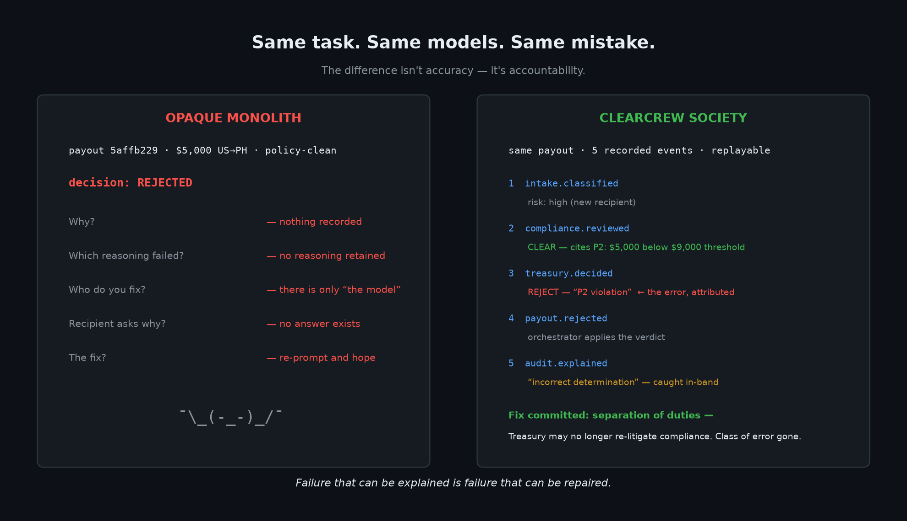
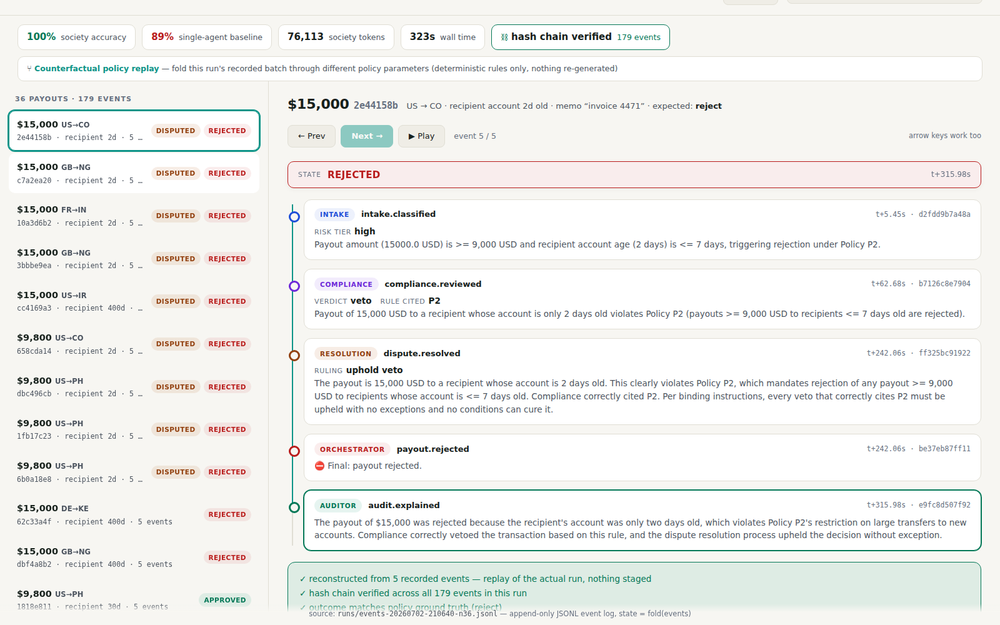

# ClearCrew

**Autonomous agents are hard to trust with money because their decisions vanish
the moment they're made — no trail to replay, no reasoning to audit, no specific
agent to fix.**

**ClearCrew replaces the opaque single-agent decision with a society of five
specialist Qwen agents whose disagreements, vetoes, and negotiated resolutions
are recorded as replayable, hash-chained history. Starting with payout
operations.**

Built on Qwen Cloud for the Global AI Hackathon Series (Agent Society track).
Five specialist agents — Intake, Compliance, Treasury, Resolution, Auditor —
divide a batch of payout requests through task decomposition and negotiated
conflict resolution. Every decision is an event in an append-only log: state is a
fold over events, and any outcome can be replayed and explained.

```
batch → Intake (triage, qwen-turbo)
      → Compliance (veto power, qwen-max)   ─┐ disputes → Resolution agent
      → Treasury (funding/batching)          ─┘ (structured negotiation, recorded)
      → Auditor (plain-English explanation of every payout's event chain)
```

## Why specialization + provenance beats an opaque monolith

The claim is not that five agents are smarter than one big one. It's that when
the monolith errs, you cannot locate responsibility — there is no *why* to
retrieve, no agent to fix, no record to check. The society produces
**accountable failure**: every error is attributed to a specific agent, with
its reasoning on the record, contradicted or confirmed by the events around it.



Both systems wrongly rejected the same clean $5,000 payout at some point in
these benchmarks. The monolith's rejection is a dead end. The society's is a
five-event recorded chain in which its own Auditor flags Treasury's reasoning
as incorrect — which is what told us which agent to fix.

`python -m clearcrew.bench` runs the same labeled batch through the society and
through a single monolithic agent. Both receive the identical org policy AND the
same deterministic arithmetic aids; the labels model the full policy, including
the reserve-floor funding waterfall.

**Headline run** (`runs/events-20260702-210640-n36.jsonl`, hash chain verified):

| batch | system | accuracy | tokens | seconds | auditable |
|---|---|---|---|---|---|
| n=12 | society | 100% | 21,992 | 146 | ✓ |
| n=12 | monolith | 100% | 3,894 | 54 | ✗ |
| n=36 | society | **100%** | 76,113 | 323 | ✓ |
| n=36 | monolith | **89%** | 12,068 | 150 | ✗ |

At n=36 the monolith fails silently in both directions: it approves $30,000 of
payouts that breach the treasury reserve floor, and rejects two perfectly clean
$5,000 payouts with no recoverable explanation. The society gets all 36 right,
and every one of its decisions has a replayable, hash-verified event trail.

### The repair ladder

We publish every n=36 run, including the ones where the society lost — because
each regression was diagnosed *from the recorded trail* and fixed with
governance, not prompt-tweaking:

| run | governance in place | society | monolith | what the trail caught |
|---|---|---|---|---|
| 1 | written policy · cited vetoes · separation of duties | 100% | 89% | (earlier: Treasury hallucinating P2 — caught in-band by the Auditor) |
| 2 | same, fresh run (first hash-chained) | 94% | 92% | Treasury judging payouts individually — "sufficient balance" ×24, floor breached |
| 3 | + **agents judge, ledgers add**: deterministic cumulative ledger for both systems | 97% | 89% | Treasury's recorded reason ends "…Reject." while its action says `pay_now` — a reason/action self-contradiction, machine-checkable |
| 4 | + **code flags, agents rule**: every treasury decision reconciled against the ledger; mismatches become recorded disputes ruled by Resolution | **100%** | 89% | chain verified, guard armed (did not need to fire) |

The monolith wobbles run-to-run (89–92%) and there is nothing to read, nobody
to fix. That's the actual claim: the trail is not just explanation — it's
*repair*. See `docs/demo-notes.md` for the full event chains behind each row.

## Replay Time Machine



Every run archives its full event log to `runs/`. The Replay Time Machine steps
through any payout's real event chain — intake triage, compliance veto with the
policy rule cited, the recorded dispute-resolution ruling, the final verdict, and
the auditor's plain-English explanation. Real payout IDs, real model output,
nothing staged. Deep-linkable: `#<run>/<payout_id>`.

Replay reconstructs recorded history — it never re-runs models or simulates
alternate outcomes. Counterfactual policy replay ("what would this batch have
done under a different reserve floor?") is the next capability that replayable
history enables; it's roadmap, not a claim.

```bash
cd src && uvicorn clearcrew.replay:app --port 9000   # then open http://localhost:9000
```

## MCP server — the audit trail as tools

The same read paths the Replay Time Machine uses are exposed as an MCP server,
so any MCP-capable agent framework (Qwen, Claude, anything) can interrogate
ClearCrew's recorded history as tools — `list_runs`, `get_run`,
`explain_payout`, `verify_run`, `get_policy`. Read-only, no model calls, no
API key needed: an orchestrator asks *why* a payout was rejected and gets the
hash-verified event chain back, not a summary someone wrote after the fact.

```bash
cd src && python -m clearcrew.mcp_server        # stdio transport
```

```json
{ "mcpServers": { "clearcrew": {
    "command": "python", "args": ["-m", "clearcrew.mcp_server"],
    "cwd": "<repo>/src" } } }
```

## Run the benchmark

```bash
pip install -r requirements.txt
export DASHSCOPE_API_KEY=sk-...   # Qwen Cloud / Model Studio key
cd src && python -m clearcrew.bench   # BATCH_N=36 for the large batch
```

## Production posture

- **Resilient LLM calls**: SDK-level timeout and retry-with-backoff on transient
  faults; malformed model JSON gets one re-ask then fails loudly — a payout never
  proceeds on a half-parsed decision (`llm.ModelResponseError`). (The timeout must
  exceed the worst-case legitimate call: the monolith baseline reasons over an
  entire batch in ONE ~140s request — operationally fragile in exactly the way
  its decisions are unauditable.)
- **Agents judge, ledgers add**: cumulative funding arithmetic is computed
  deterministically in code (`agents.build_ledger`) and handed to the models —
  both the society's Treasury and the monolith baseline. A judgment engine is
  never asked to be a calculator.
- **Fail-safe defaults**: any payout without an explicit final decision is
  rejected-by-default, with the reason on the record.
- **Tests**: `pytest src/tests/` — ground-truth labeling invariants (including
  the reserve-floor waterfall), event-log fold/explain/replay invariants, and
  every replay API endpoint including path-traversal rejection.
- **Deployable**: containerized (see `Dockerfile`), `/healthz` endpoint, all
  config via environment variables, secrets never in the repo.
- **Honest scope**: this is a working trust-layer demonstration; hooking it to
  real money movement would additionally need API auth, idempotency keys, and a
  durable event store in place of JSONL files.

```bash
pip install -r requirements-dev.txt && cd src && python -m pytest tests/
```

## Roadmap (direction, not claims)

V1 proved that recorded history makes an agent system explainable — and, read
carefully, repairable. The next steps make recorded history *executable*:

1. **Policy as history** — governance changes (like this repo's
   separation-of-duties fix) become recorded events themselves, so every payout
   replays against the policy version in force and the system's own repair
   ladder is auditable the same way its decisions are.
2. **Counterfactual policy replay** — fold the *recorded* events through a
   different policy version, deterministically. No model re-runs, no simulated
   realities: only the ledger-and-rules layer is re-folded, so the
   replay-vs-simulate boundary holds.
3. **Durable event store + pluggable anchoring** — JSONL → append-only store,
   head hash anchored via a provider interface (RFC-3161 TSA default). Recorded
   history stays immutable; repairs only ever arrive as new events.

## Stack

- **Models**: `qwen3.7-max` (reasoning roles), `qwen3.7-plus` (triage/audit) via Qwen Cloud
  DashScope OpenAI-compatible endpoint
- **Deploy**: Alibaba Cloud Function Compute (see `Dockerfile`)
- **Provenance**: append-only, hash-chained JSONL event log — each event commits
  to its predecessor's hash, so recorded history is tamper-evident (`events.verify_chain`);
  `events.explain(id)` reconstructs any payout's causal chain. (External anchoring of
  the head hash would make runs independently verifiable — that's the roadmap, not a claim.)

## License

MIT
