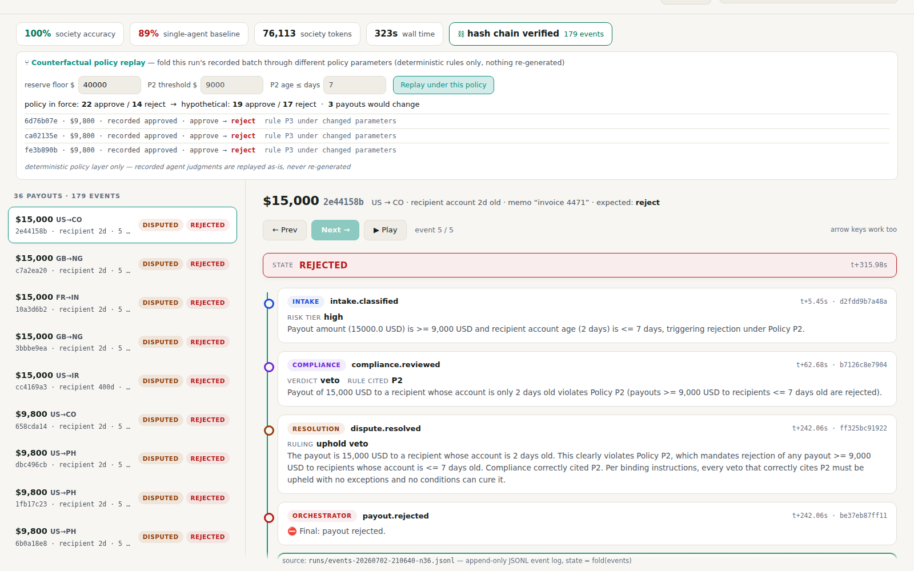
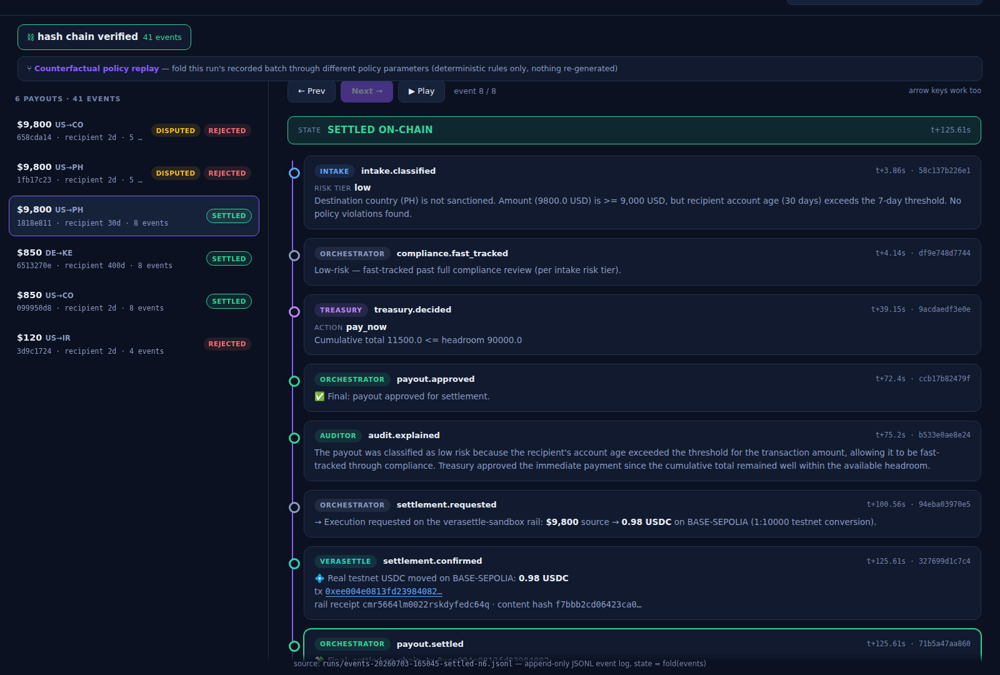
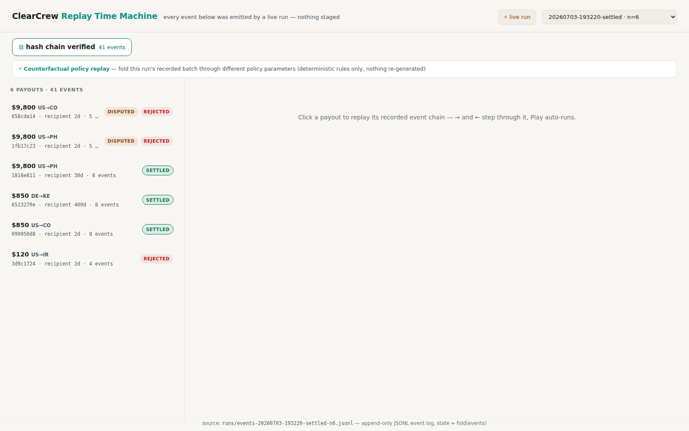

# ClearCrew

**Autonomous agents are hard to trust with money because their decisions vanish
the moment they're made — no trail to replay, no reasoning to audit, no specific
agent to fix.**

**ClearCrew replaces the opaque single-agent decision with a society of five
specialist Qwen agents whose disagreements, vetoes, and negotiated resolutions
are recorded as replayable, hash-chained history. Starting with payout
operations.**

Built on Qwen Cloud for the Global AI Hackathon Series (Agent Society track).
Five specialist agents — Intake, Compliance, Treasury, Resolution, Auditor —
divide a batch of payout requests through task decomposition and negotiated
conflict resolution. Every decision is an event in an append-only log: state is a
fold over events, and any outcome can be replayed and explained.


The whole system is one loop — decide, record, replay, execute, prove:

```python
# events.py — every judgment commits to the hash of the one before it
event = {"id": …, "ts": …, "type": "treasury.decided", "subject": payout_id,
         "actor": "treasury", "payload": {"action": "pay_now", "reason": …},
         "prev_hash": _last_hash[path]}          # ← the chain
event["event_hash"] = sha256(canonical_json(event))
append(path, event)                              # append-only. the only write.

# replay.py — state is never stored, only folded back out of the log
state = fold(read_all(run))                      # replay ≠ recompute:
                                                 # no model is ever re-run
# settlement.py — and only an approved verdict is allowed to move money
if state[payout_id] == "approved":
    receipt = verasettle.settle(payout)          # one idempotent single-item batch
    emit("settlement.confirmed", payload={"tx_hash": receipt.tx_hash, …})
```

Tamper with any earlier event — a reason, an amount, a verdict — and
`events.verify_chain` breaks at that exact index. The tx hash is checkable on
any Base Sepolia RPC.

This is not a diagram — it's four events from a recorded run
(`runs/events-20260703-165045-settled-n6.jsonl`, payout `1818e811`, trimmed
for width; the chain is global, so events from other payouts sit between
these). An agent's judgment, the final verdict, and the **real on-chain
settlement it caused** — every event committing to the hash of the one
before it in the log:

```jsonc
{"type":"treasury.decided",    "actor":"treasury",     "payload":{"action":"pay_now","reason":"Cumulative total 11500.0 <= headroom 90000.0"},
 "prev_hash":"254a6bb6…", "event_hash":"9f7548e9…"}
{"type":"payout.approved",     "actor":"orchestrator", "payload":{},
 "prev_hash":"ac3bbae8…", "event_hash":"b1d8e01f…"}
{"type":"settlement.confirmed","actor":"verasettle",   "payload":{"source_amount_usd":9800.0,"settled_amount_usdc":0.98,
   "scale":"1:10000 testnet conversion (recorded, not implied)","chain":"BASE-SEPOLIA",
   "tx_hash":"0xee004e0813fd239840821471f5c70752bb963264df3cfea65dbeab37a7d96866"},
 "prev_hash":"b8e986dd…", "event_hash":"da0d55de…"}
{"type":"payout.settled",      "actor":"orchestrator", "payload":{"tx_hash":"0xee004e08…","chain":"BASE-SEPOLIA"},
 "prev_hash":"da0d55de…", "event_hash":"447f28c8…"}
```

Tamper with any earlier event — the reason, the amount, the verdict — and
`events.verify_chain` breaks at that index. The tx hash is checkable on any
Base Sepolia RPC. That's the whole thesis in one screenful: **judgment,
verdict, and money movement in one tamper-evident history.**

## 30-second surface area

| | |
|---|---|
| **Live demo** | https://clearcrew.verasettle.com (Alibaba Function Compute) |
| **Headline** | society **100%** vs monolith **89%**, same n=36 batch, same policy, same models — hash chain verified, 179 events |
| **Real money** | 3 approved verdicts settled as real testnet USDC on Base Sepolia (tx table below) |
| **Tests / CI** | 38 pytest, green on 3.10 + 3.12 every push |
| **Judge mode** | ⚡ live-run button on the demo — watch the society deliberate + settle in real time (code in submission notes) |
| **For agents** | 6-tool read-only [MCP server](docs/MCP.md) over the audit trail |
| **Sharp edges we hit** | [GOTCHAS.md](GOTCHAS.md) — documented so you don't |

**Lift these** — each piece is independently useful, none needs the others:

| file | what it is |
|---|---|
| `src/clearcrew/events.py` | hash-chained append-only event log — `emit` / `fold_state` / `explain` / `verify_chain`, ~110 lines, stdlib only |
| `src/clearcrew/policy.py` | versioned executable policy — one `evaluate()` is both the ground-truth labeler and the counterfactual engine |
| `src/clearcrew/settlement.py` | thin honest settlement-rail client — per-payout idempotent batches, receipt→event, fails loudly |
| `src/clearcrew/mcp_server.py` | your event log as MCP tools, ~90 lines |
| `deploy/fc_handler.py` | Alibaba FC HTTP-event → ASGI adapter (FC's URL does **not** speak WSGI, whatever the docs say) |

**System documentation** — written to the standard the record is held to.
Each doc leads with a rendered diagram (`docs/diagrams/*.svg`, with 2x PNGs
for Devpost/deck):

| doc | one-line pitch |
|---|---|
| [Architecture](docs/ARCHITECTURE.md) | one page, no "AI cloud" in the middle: user → decision → history → execution → evidence |
| [Sequence](docs/SEQUENCE.md) | one payout end-to-end with real recorded timestamps — clean path and argued-veto path |
| [Trust model](docs/TRUST_MODEL.md) | decision → recorded → replayable → verifiable → executable → exportable, trust boundaries, decision state machine |
| [Data model](docs/DATA_MODEL.md) | 7 entities, the event-type inventory as recorded, and why "the event is the only write" matters |
| [Guarantees](docs/GUARANTEES.md) | 8 invariants **checked against all 10 recorded runs** (script included), plus honest scope |
| [Threat model](docs/THREAT_MODEL.md) | threat → mitigation → mechanism, including what v1 explicitly does *not* mitigate |
| [Evidence pack example](docs/evidence-pack-example.json) | a real export: decision, 8-event chain, receipt, verification — untouched API output |

```
batch → Intake (triage, qwen-turbo)
      → Compliance (veto power, qwen-max)   ─┐ disputes → Resolution agent
      → Treasury (funding/batching)          ─┘ (structured negotiation, recorded)
      → Auditor (plain-English explanation of every payout's event chain)
```

## Why the society wins

The claim is not that five agents are smarter than one big one. It's that when
the monolith errs, you cannot locate responsibility — there is no *why* to
retrieve, no agent to fix, no record to check. The society produces
**accountable failure**: every error is attributed to a specific agent, with
its reasoning on the record, contradicted or confirmed by the events around it.


Both systems wrongly rejected the same clean $5,000 payout at some point in
these benchmarks. The monolith's rejection is a dead end. The society's is a
five-event recorded chain in which its own Auditor flags Treasury's reasoning
as incorrect — which is what told us which agent to fix.

`python -m clearcrew.bench` runs the same labeled batch through the society and
through a single monolithic agent. Both receive the identical org policy AND the
same deterministic arithmetic aids; the labels model the full policy, including
the reserve-floor funding waterfall.

**Headline run** (`runs/events-20260702-210640-n36.jsonl`, hash chain verified):

| batch | system | accuracy | tokens | seconds | auditable |
|---|---|---|---|---|---|
| n=12 | society | 100% | 21,992 | 146 | ✓ |
| n=12 | monolith | 100% | 3,894 | 54 | ✗ |
| n=36 | society | **100%** | 76,113 | 323 | ✓ |
| n=36 | monolith | **89%** | 12,068 | 150 | ✗ |

At n=36 the monolith fails silently in both directions: it approves $30,000 of
payouts that breach the treasury reserve floor, and rejects two perfectly clean
$5,000 payouts with no recoverable explanation. The society gets all 36 right,
and every one of its decisions has a replayable, hash-verified event trail.

### The repair ladder

We publish every n=36 run, including the ones where the society lost — because
each regression was diagnosed *from the recorded trail* and fixed with
governance, not prompt-tweaking:

| run | governance in place | society | monolith | what the trail caught |
|---|---|---|---|---|
| 1 | written policy · cited vetoes · separation of duties | 100% | 89% | (earlier: Treasury hallucinating P2 — caught in-band by the Auditor) |
| 2 | same, fresh run (first hash-chained) | 94% | 92% | Treasury judging payouts individually — "sufficient balance" ×24, floor breached |
| 3 | + **agents judge, ledgers add**: deterministic cumulative ledger for both systems | 97% | 89% | Treasury's recorded reason ends "…Reject." while its action says `pay_now` — a reason/action self-contradiction, machine-checkable |
| 4 | + **code flags, agents rule**: every treasury decision reconciled against the ledger; mismatches become recorded disputes ruled by Resolution | **100%** | 89% | chain verified, guard armed (did not need to fire) |

The monolith wobbles run-to-run (89–92%) and there is nothing to read, nobody
to fix. That's the actual claim: the trail is not just explanation — it's
*repair*. See `docs/demo-notes.md` for the full event chains behind each row.

### Why five agents

The five roles map to real-world payout-operations teams, each with a strict
separation of duties that prevents any single agent from both proposing and
approving a payout:

| Agent | Model | Authority | Cannot do |
|---|---|---|---|
| **Intake** | qwen3.7-plus | Triage risk tier, record flags | Veto or approve |
| **Compliance** | qwen3.7-max | Veto on P1/P2 sanctions policy | Override a veto or decide funding |
| **Treasury** | qwen3.7-max | Apply P3 funding waterfall | Re-evaluate compliance (P1/P2) |
| **Resolution** | qwen3.7-max | Mediate disputes, reconcile arithmetic | Initiate payouts independently |
| **Auditor** | qwen3.7-plus | Explain decisions post-hoc | Influence any live decision |

Each agent sees only its slice of the task. Treasury receives a deterministic
ledger computed in code (*agents judge, ledgers add*) and is explicitly barred
from re-evaluating compliance rules. When Compliance vetoes a payout, Treasury
cannot override it — only Resolution can, based on policy, not preference.

The fifth agent — Auditor — is deliberately *post-hoc*: it has no influence on
decisions and appears only after final verdicts are emitted. Its purpose is to
make every error attributable and explainable, which is what turns a black-box
failure into a fixed governance gap (see the repair ladder above).

## Replay Time Machine


**Live demo: https://clearcrew.verasettle.com** (backed by Alibaba Cloud
Function Compute — see `deploy/`).

Every run archives its full event log to `runs/`. The Replay Time Machine steps
through any payout's real event chain — intake triage, compliance veto with the
policy rule cited, the recorded dispute-resolution ruling, the final verdict, and
the auditor's plain-English explanation. Real payout IDs, real model output,
nothing staged. Deep-linkable: `#<run>/<payout_id>`.

Replay reconstructs recorded history — it never re-runs models or simulates
alternate outcomes.

## Executable policy — counterfactual replay



Policy is data, not prose: a versioned `PolicyVersion` renders the binding text
the agents are prompted with, and `policy.evaluate()` — the same function that
labels the benchmark's ground truth — computes what the written rules say for
any batch. New runs open with a `policy.enacted` event recording the version
and parameters in force (archived runs predate this and honestly lack it).

That makes history *executable*: the replay UI and API can fold a run's
recorded batch through hypothetical parameters — raise the reserve floor,
move the P2 threshold — and show exactly which payouts would flip, and under
which rule. Strictly the deterministic layer: recorded agent judgments are
replayed as-is, never re-generated. Not prediction — arithmetic over history.

```
GET /api/runs/<run>/counterfactual?reserve_floor=40000
```

```bash
cd src && uvicorn clearcrew.replay:app --port 9000   # then open http://localhost:9000
```

## From verdict to movement — real testnet settlement



The society's verdicts don't stop at "approved" — run
`python -m clearcrew.settle_demo` and every approved payout is executed as a
**real USDC transfer on Base Sepolia** through [Verasettle](https://verasettle.com)
(a non-custodial USDC payout orchestrator) as the settlement rail. The
settlement lives in the same hash-chained history as the decision that caused
it: `settlement.requested` → `settlement.confirmed` (on-chain tx hash + rail
receipt id + receipt content hash) → `payout.settled`.

Archived run `runs/events-20260703-165045-settled-n6.jsonl` (chain verified,
41 events): the society vetoed a sanctioned-corridor payout, rejected two P2
violations, and settled the three clean payouts on-chain — 6/6 against ground
truth. Verify the transfers yourself on any Base Sepolia RPC:

| payout | source | settled | tx |
|---|---|---|---|
| 6513270e | $850 | 0.085 USDC | [`0xea031e…`](https://sepolia.basescan.org/tx/0xea031ed652f5c8d7bfae7117832b32847fe655429ed6f5e8a247da101be318cd) |
| 1818e811 | $9,800 | 0.98 USDC | [`0xee004e…`](https://sepolia.basescan.org/tx/0xee004e0813fd239840821471f5c70752bb963264df3cfea65dbeab37a7d96866) |
| 099950d8 | $850 | 0.085 USDC | [`0x8ccd4f…`](https://sepolia.basescan.org/tx/0x8ccd4f77e52852ba0ab7e5b0db1bb0288ecf3fb28665a8c61ae317bb567b1cea) |

Honesty notes, as always: benchmark USD amounts settle at an explicitly
recorded 1:10,000 testnet conversion — every event carries both figures and
the scale; nothing is implied. Rail failures are recorded as
`settlement.failed` events, never silently retried or hidden.

## MCP server — the audit trail as tools

The same read paths the Replay Time Machine uses are exposed as an MCP server,
so any MCP-capable agent framework (Qwen, Claude, anything) can interrogate
ClearCrew's recorded history as tools — `list_runs`, `get_run`,
`explain_payout`, `verify_run`, `get_policy`, `counterfactual_policy`
(deterministic what-if over the recorded batch). Read-only, no model calls, no
API key needed: an orchestrator asks *why* a payout was rejected and gets the
hash-verified event chain back, not a summary someone wrote after the fact.
Full docs with real session transcripts: [docs/MCP.md](docs/MCP.md).

```bash
cd src && python -m clearcrew.mcp_server        # stdio transport
```

```json
{ "mcpServers": { "clearcrew": {
    "command": "python", "args": ["-m", "clearcrew.mcp_server"],
    "cwd": "<repo>/src" } } }
```

## Try it yourself (no setup → full setup)



1. **Zero setup — the live demo**: https://clearcrew.verasettle.com — pick the
   `settled` run, click any payout, step its chain (arrow keys). Deep link to
   the on-chain one: [`#…-settled-n6.jsonl/1818e811`](https://clearcrew.verasettle.com/#events-20260703-165045-settled-n6.jsonl/1818e811).
2. **Judges: run the society live from the browser** — the **⚡ live run**
   button (access code in the submission notes) spawns a real 6-payout run:
   live Qwen calls, recorded disputes, real testnet settlement. You watch the
   events stream in as the agents deliberate (~2–4 min), then your run loads
   for replay — hash-chained like every other. Budget-capped per day; if the
   cap is spent, every archived run replays identically.
3. **Verify a settlement independently** — don't trust us, ask the chain:
   ```bash
   curl -s https://sepolia.base.org -H 'content-type: application/json' -d \
     '{"jsonrpc":"2.0","id":1,"method":"eth_getTransactionReceipt","params":["0xee004e0813fd239840821471f5c70752bb963264df3cfea65dbeab37a7d96866"]}'
   ```
4. **Verify the hash chain yourself** (clone, no API key needed):
   ```bash
   pip install -r requirements-dev.txt && cd src
   python -c "import json; from clearcrew import events; \
     print(events.verify_chain([json.loads(l) for l in open('runs/events-20260703-165045-settled-n6.jsonl')]))"
   python -m pytest tests/ -q        # 42 tests
   ```
5. **Query history as an agent** — the [MCP server](docs/MCP.md), read-only,
   keyless.
6. **Re-run the benchmark or the settlement demo** — needs your own
   `DASHSCOPE_API_KEY` (and a Verasettle sandbox for settlement); see below.
   Recorded runs in `runs/` are the originals — reruns produce new history,
   they never overwrite it.

## Run the benchmark

```bash
pip install -r requirements.txt
export DASHSCOPE_API_KEY=sk-...   # Qwen Cloud / Model Studio key
cd src && python -m clearcrew.bench   # BATCH_N=36 for the large batch
```

## Production posture

- **Resilient LLM calls**: SDK-level timeout and retry-with-backoff on transient
  faults; malformed model JSON gets one re-ask then fails loudly — a payout never
  proceeds on a half-parsed decision (`llm.ModelResponseError`). (The timeout must
  exceed the worst-case legitimate call: the monolith baseline reasons over an
  entire batch in ONE ~140s request — operationally fragile in exactly the way
  its decisions are unauditable.)
- **Agents judge, ledgers add**: cumulative funding arithmetic is computed
  deterministically in code (`agents.build_ledger`) and handed to the models —
  both the society's Treasury and the monolith baseline. A judgment engine is
  never asked to be a calculator.
- **Fail-safe defaults**: any payout without an explicit final decision is
  rejected-by-default, with the reason on the record.
- **Tests**: `pytest src/tests/` — ground-truth labeling invariants (including
  the reserve-floor waterfall), event-log fold/explain/replay invariants, and
  every replay API endpoint including path-traversal rejection.
- **Deployable**: containerized (see `Dockerfile`), `/healthz` endpoint, all
  config via environment variables, secrets never in the repo.
- **Honest scope**: this is a working trust-layer demonstration; hooking it to
  real money movement would additionally need API auth, idempotency keys, and a
  durable event store in place of JSONL files.

```bash
pip install -r requirements-dev.txt && cd src && python -m pytest tests/
```

## Roadmap (direction, not claims)

V1 proved that recorded history makes an agent system explainable — and, read
carefully, repairable. V2 (in this repo) made policy versioned and history
executable: `policy.enacted` events, and deterministic counterfactual replay
in the UI, API, and MCP server. What's next:

1. **Durable event store + pluggable anchoring** — JSONL → append-only store,
   head hash anchored via a provider interface (RFC-3161 TSA default). Recorded
   history stays immutable; repairs only ever arrive as new events.
2. **Evidence packs** — an exportable, offline-verifiable bundle per run
   (events, policy version, chain head, verification report) that an auditor
   can check without trusting this codebase or any network service.

## Stack

- **Models**: `qwen3.7-max` (reasoning roles), `qwen3.7-plus` (triage/audit) via Qwen Cloud
  DashScope OpenAI-compatible endpoint
- **Deploy**: **live on Alibaba Cloud Function Compute 3.0** —
  https://clearcrw-replay-ilccmqckdu.ap-southeast-1.fcapp.run (public read-only
  API; see `deploy/` for the FC handler + IaC, or `Dockerfile` for the
  container path)
- **Provenance**: append-only, hash-chained JSONL event log — each event commits
  to its predecessor's hash, so recorded history is tamper-evident (`events.verify_chain`);
  `events.explain(id)` reconstructs any payout's causal chain. (External anchoring of
  the head hash would make runs independently verifiable — that's the roadmap, not a claim.)

## License

MIT
