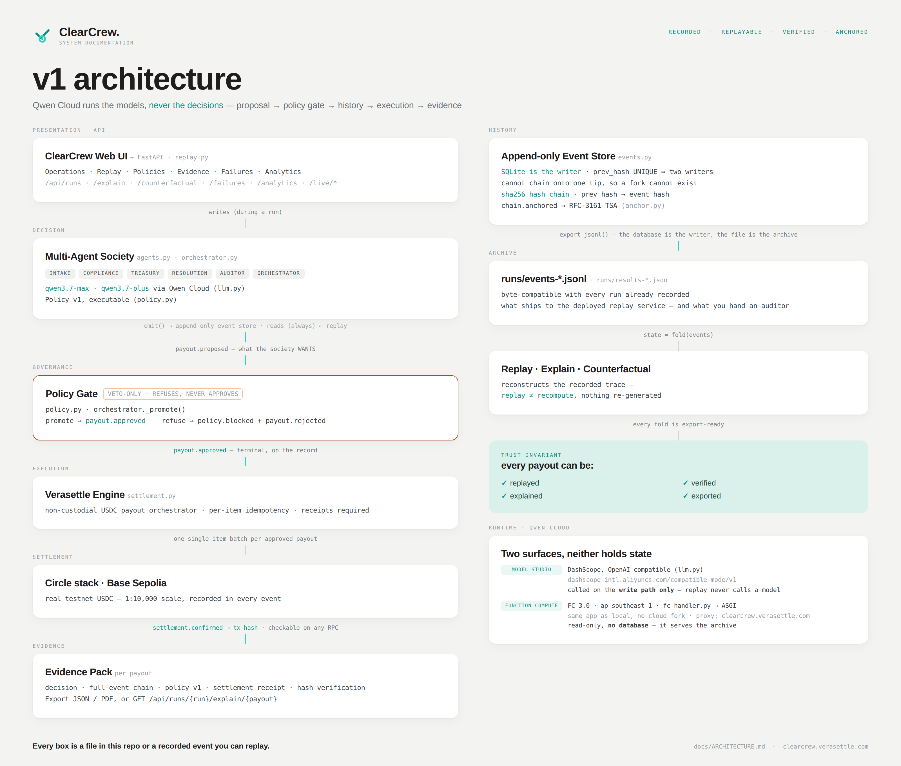

# ClearCrew v1 Architecture



One page. The architecture *is* the thesis:
**Proposals → Governance → History → Execution → Evidence**.

Qwen Cloud runs the models and hosts the service ([Runtime](#runtime)); it does not
run the decisions. Nothing opaque sits between a proposal and a recorded decision —
every box below is a file in this repo or an event you can replay.

> **Trust invariant.** Agents never decide; they *propose*. The only path from a
> proposal to a recorded decision runs through the deterministic policy gate,
> and the gate may only ever **refuse**. An approval that P1/P2/P3 forbid cannot
> exist in the log — not as a bug to be caught later, but as a state the system
> cannot represent.

```text
                                    USERS
                      finance team · operations · auditor
                                      │
                                      ▼
                       ┌───────────────────────────────┐
                       │        ClearCrew Web UI       │
                       │  Operations · Replay · Policy │
                       │  Failures · Analytics ·       │
                       │  Evidence  (static/index.html)│
                       └───────────────┬───────────────┘
                                       │  REST (JSON) · 2.5s polling in judge mode
                                       ▼
   ┌───────────────────────────────────────────────────────────────────┐
   │                 FastAPI backend  (replay.py)                      │
   │   /api/runs · /explain · /counterfactual · /failures              │
   │   /analytics · /policies · /overview · /live/*                    │
   └────────────┬───────────────────────────────────────┬──────────────┘
                │ writes (during a run)                  │ reads (always)
                ▼                                        ▼
   ┌────────────────────────────┐          ┌─────────────────────────────┐
   │   Multi-Agent Society      │          │  Append-only Event Store    │
   │   (agents.py,              │  emit()  │  (events.py)                │
   │    orchestrator.py)        │ ───────▶ │                             │
   │                            │          │  SQLite writer (UNIQUE      │
   │  intake      · compliance  │          │  prev_hash ⇒ forks can't    │
   │  treasury    · resolution  │          │  exist) · sha256 chain      │
   │  auditor     + orchestrator│          │  (prev_hash → event_hash)   │
   │   Qwen3.7 via Qwen Cloud   │          │  → export_jsonl() → runs/   │
   └────────────┬───────────────┘          │  chain.anchored ───────────────▶ RFC-3161 TSA
                │                          │  the head hash, signed by   │    (anchor.py)
                │ payout.proposed          │  an independent authority   │    freetsa · digicert
                │ (what the society WANTS, │                             │    · sectigo
                │  not yet a decision)     └──────────────┬──────────────┘
                ▼                                         │ fold(events)
   ┌────────────────────────────┐                         ▼
   │       POLICY GATE          │          ┌─────────────────────────────┐
   │  (policy.py + _promote)    │          │  Replay / Explain /         │
   │                            │          │  Counterfactual engine      │
   │  promote → payout.approved │          │  state = fold(events);      │
   │  refuse  → policy.blocked  │          │  replay ≠ recompute         │
   │          + payout.rejected │          └─────────────────────────────┘
   │                            │
   │  VETO-ONLY: it can refuse  │
   │  an approval, never make   │
   │  one. The reserve floor is │
   │  an invariant, not a grade │
   └────────────┬───────────────┘
                │ payout.approved
                │ (terminal decision
                │  on the record)
                ▼
   ┌────────────────────────────┐
   │     Verasettle Engine      │
   │     (settlement.py)        │
   │  non-custodial USDC payout │
   │  orchestrator · per-item   │
   │  idempotency · receipts    │
   └────────────┬───────────────┘
                │ one single-item batch per approved payout
                ▼
        Circle stack · Base Sepolia
          real testnet USDC (1:10,000 scale, recorded in every event)
                │
                ▼
        settlement.confirmed  →  tx hash, checkable on any Base Sepolia RPC
                │
                ▼
   ┌───────────────────────────────────────────┐   ┌──────────────────────────┐
   │        Evidence Pack (per payout)         │   │      Trust Invariant     │
   │  decision · full event chain · policy v1  │   │  every payout can be:    │
   │  settlement receipt · hash verification   │   │  ✓ replayed              │
   │  → Export JSON / PDF from the UI, or      │   │  ✓ explained             │
   │    GET /api/runs/{run}/explain/{payout}   │   │  ✓ verified              │
   └───────────────────────────────────────────┘   │  ✓ exported              │
                                                    └──────────────────────────┘
```

## Layers

### Presentation
Single-file web UI (`src/clearcrew/static/index.html`): Operations, Replay,
Policies, Evidence, Failures, Analytics. Also a read-only [MCP server](MCP.md)
so agents get the same audit trail humans do.

### Decision layer — the moat
Five specialist Qwen agents (`agents.py`) plus a deterministic orchestrator
(`orchestrator.py`):

```text
Qwen models (llm.py)
      │
      ▼
intake → treasury → compliance → resolution → auditor
```

Produces decisions, disagreements, vetoes, and negotiated resolutions —
all as events, never as ephemeral prompt output.

### History layer — the thesis
`events.py`: every event commits to its predecessor with
`prev_hash → event_hash` (sha256 over the canonical JSON of the event
including its predecessor's hash, anchored at a genesis constant).

**The database is the writer; the file is the archive.** A chain is sound only if
exactly one writer at a time reads the tip and appends to it. A per-process lock
cannot promise that — this system has always run more than one process against the
log (an MCP server and a batch run are two), and two writers chaining onto the same
tip produce a **fork**: every event present, both branches internally hash-valid, and
a linear walk misreporting it as tampering. So the constraint lives in the store, as
`prev_hash TEXT NOT NULL UNIQUE` in SQLite — the second writer's INSERT simply fails
and retries against the new tip. A fork isn't detected after the fact; it cannot be
represented. (Same move as `@civ/history`'s `UNIQUE(world_id, parent_hash)`.) The
table also buys indexed `explain()` lookups and `emit()` idempotency, neither of
which a flat file could give.

`export_jsonl()` then writes `runs/events-*.jsonl` (plus `runs/results-*.json`),
byte-compatible with every run already recorded. That archive — not the database —
is what ships to the deployed replay service and what you hand an auditor.

```text
decision events
      │
      ▼
append-only event store
      ├── replay          (reconstruct the recorded trace)
      ├── explain         (per-payout chain, verbatim reasons)
      ├── counterfactual  (re-fold the batch under different policy params —
      │                    deterministic, nothing re-generated)
      └── verification    (verify_chain recomputes every hash)
```

State is `fold(events)`. Replay reconstructs recorded history; it never
re-runs a model.

### Execution layer — Verasettle
ClearCrew decides; **Verasettle** (a non-custodial USDC payout orchestrator)
executes. One single-item batch per approved payout gives an unambiguous
decision→settlement mapping with per-item idempotency on the rail side.
Receipts (with on-chain tx hash) come back as `settlement.confirmed` events.

### Settlement layer
Circle stack → Base Sepolia → real testnet USDC. Testnet honesty: source
amounts are benchmark USD; on-chain movement is real USDC at an explicitly
recorded 1:10,000 scale — every settlement event carries both numbers and
the scale. The record never claims more than what moved.

### Evidence layer
The buyer doesn't care about the agent. They care about **decision →
execution → proof**. The evidence pack is one export away
([real example](evidence-pack-example.json)):

```text
Evidence Pack
  ✓ decision            ✓ receipt (tx hash)
  ✓ full event chain    ✓ hash verification
  ✓ policy v1           ✓ expected-vs-actual (ground truth)
```

## Runtime

Two Qwen Cloud surfaces, deliberately kept apart — one supplies reasoning, the
other supplies hosting. Neither holds state.

**Models — Qwen Cloud Model Studio (DashScope).** `llm.py` calls the
OpenAI-compatible endpoint (`DASHSCOPE_BASE_URL`, default
`https://dashscope-intl.aliyuncs.com/compatible-mode/v1`, authed with
`DASHSCOPE_API_KEY`). `qwen3.7-max` takes the reasoning-heavy roles
(compliance, treasury, negotiation); `qwen3.7-plus` takes the cheap per-payout
calls (intake triage, audit explanations). Both are env-overridable — see
`config.py`. Models are called only on the **write** path, while a run is
producing proposals; replay never calls one.

**Hosting — Alibaba Cloud Function Compute 3.0** (`ap-southeast-1`, function
`clearcrew-replay`, `python3.10`). `deploy/fc_handler.py` adapts FC's HTTP-trigger
event to ASGI and invokes the same `clearcrew.replay:app` that runs locally — the
cloud gets no fork of the application. FC forces
`Content-Disposition: attachment` on its default `fcapp.run` domain, which makes a
browser download the UI instead of rendering it, so the frontend is served through a
thin reverse proxy (TLS + header stripping, nothing else) at
**clearcrew.verasettle.com**. Full deployment detail: [`deploy/README.md`](../deploy/README.md).

**Frontend → backend → data.** The single-file UI calls the FastAPI app over REST
(2.5s polling in judge mode); the app reads the exported JSONL archive bundled with
the function. The deployed replay service is read-only and carries **no database** —
SQLite is the writer's store during a run, and only its `export_jsonl()` output
ships. That is why the public API needs no key and cannot mutate history.

## Why the diagram looks like this

```text
user → decision → history → execution → evidence
```

That's the same mental model the frontend uses (Operations → Replay →
Evidence), the same order the events land in the log, and the same story the
3-minute demo tells. One system, one flow, told three ways.
