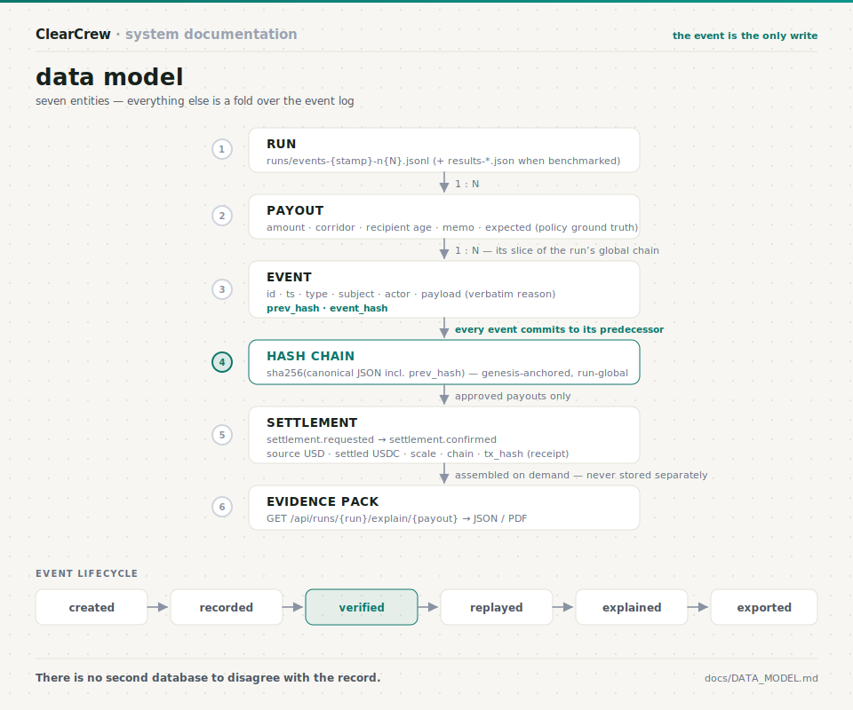

# Data Model



Seven entities. Everything else is a fold.

```text
 ┌───────────────────────────────────────────────────────────────────┐
 │ RUN                          runs/events-{stamp}-n{N}.jsonl       │
 │ one batch execution          (+ runs/results-{stamp}-n{N}.json    │
 │                               when benchmarked vs the monolith)   │
 └───────────────┬───────────────────────────────────────────────────┘
                 │ 1 : N
                 ▼
 ┌───────────────────────────────────────────────────────────────────┐
 │ PAYOUT                       subject id, amount, corridor,        │
 │ one requested transfer       recipient age, memo, expected        │
 │                              (policy ground truth)                │
 └───────────────┬───────────────────────────────────────────────────┘
                 │ 1 : N   (its slice of the run's global chain)
                 ▼
 ┌───────────────────────────────────────────────────────────────────┐
 │ EVENT                        id · ts · type · subject · actor ·   │
 │ one recorded judgment        payload (verbatim reason) ·          │
 │ or state change              prev_hash · event_hash               │
 └───────────────┬───────────────────────────────────────────────────┘
                 │ every event commits to its predecessor
                 ▼
 ┌───────────────────────────────────────────────────────────────────┐
 │ HASH CHAIN                   sha256(canonical JSON incl.          │
 │ run-global, genesis-         prev_hash) — verify_chain()          │
 │ anchored                     recomputes it and reports the        │
 │                              exact break index                    │
 └───────────────┬───────────────────────────────────────────────────┘
                 │ approved payouts only
                 ▼
 ┌───────────────────────────────────────────────────────────────────┐
 │ SETTLEMENT                   settlement.requested →               │
 │ one single-item batch        settlement.confirmed with            │
 │ per approved payout          source USD, settled USDC, scale,     │
 │                              chain, tx_hash (the receipt)         │
 └───────────────┬───────────────────────────────────────────────────┘
                 │ assembled on demand — never stored separately
                 ▼
 ┌───────────────────────────────────────────────────────────────────┐
 │ EVIDENCE PACK                payout + full event chain +          │
 │ GET /api/runs/{run}/         verification result + receipt        │
 │     explain/{payout}         → export JSON / PDF                  │
 └───────────────────────────────────────────────────────────────────┘
```

## Event lifecycle

```text
 created ──▶ recorded ──▶ verified ──▶ replayed ──▶ explained ──▶ exported
 (agent      (appended,    (chain       (fold —      (verbatim     (evidence
  emits)      hashed,       recomputed   never        reasons +     pack, one
              flushed)      end-to-end)  re-run)      audit         GET away)
                                                      narrative)
```

Two properties do the heavy lifting:

- **The event is the only write.** Nothing else persists. The UI, the
  analytics, the failure taxonomy, the counterfactuals — all are folds over
  `runs/*.jsonl`. There is no second database to disagree with the record.
- **The chain is global per run.** Events from different payouts interleave,
  and each commits to the hash of whatever came before it in the log —
  so reordering or deleting *any* event breaks verification for the whole run,
  not just one payout's slice.

## Event type inventory (as recorded, not aspirational)

| type | actor | meaning |
|---|---|---|
| `batch.received` / `batch.completed` | orchestrator | run boundaries |
| `policy.enacted` | orchestrator | the policy text in force, on the record |
| `intake.classified` | intake | risk tier + verbatim reason |
| `compliance.fast_tracked` | orchestrator | low-risk lane; the skip itself is recorded |
| `compliance.reviewed` | compliance | clear or veto, rule cited |
| `treasury.decided` | treasury | pay_now / reject vs reserve headroom |
| `dispute.resolved` | resolution | ruling on a veto, argued on the record |
| `payout.proposed` | treasury / compliance / resolution | **what the society wants to do — not yet a decision.** The unit the benchmark grades |
| `policy.blocked` | policy | **an approval the gate refused** (P1/P2/P3). The agent's intent survives; only its effect is denied |
| `payout.approved` / `payout.rejected` | orchestrator | the terminal decision (exactly one per payout) — reachable *only* through the gate |
| `settlement.requested` / `settlement.confirmed` | orchestrator / verasettle | rail call and receipt (tx hash) |
| `payout.settled` | orchestrator | decision → money, linked |
| `audit.explained` | auditor | plain-language narrative |
| `reconciliation.flagged` | auditor | recorded anomaly, attributed |
| `chain.anchored` | anchor | the head hash, signed by an independent RFC-3161 authority |
| `chain.anchor_failed` | anchor | an anchor that did **not** succeed — recorded as a failure, never as a success |

Counts across the 21 archived runs: 372 `payout.proposed`, 354 `payout.approved`,
228 `payout.rejected`, 11 `chain.anchored`, 0 `chain.anchor_failed`.

**Why `payout.proposed` and `payout.approved` are different events.** Collapsing
them would destroy two things at once: the ability to grade the *agents* (after a
gate, terminal decisions agree with policy by construction, so scoring them would
read 100% forever) and the ability to see an agent's rejected intent at all. The
proposal is what the society judged; the terminal decision is what governance
allowed. Recording only the second would be a system that quietly hides its own
near-misses.
