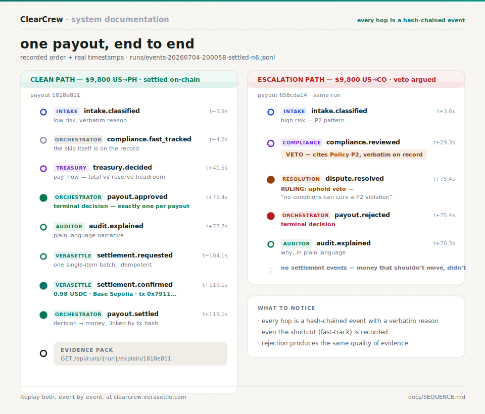

# One Payout, End to End



Not a hypothetical — these are the recorded event orders of payouts `1818e811`
(approve path) and `658cda14` (escalation path) from
`runs/events-20260704-200058-settled-n6.jsonl`, timestamps included. Every
arrow below exists as a hash-chained event you can replay at
[clearcrew.verasettle.com](https://clearcrew.verasettle.com), or read raw in
[the evidence pack export](evidence-pack-example.json).

## The clean path — $9,800 US→PH, settled on-chain

```text
 user / batch
      │  payout submitted (batch.received)
      ▼
 INTAKE            intake.classified          low risk + verbatim reason      t+3.9s
      │
      ▼
 ORCHESTRATOR      compliance.fast_tracked    low-risk lane — full review     t+4.2s
      │                                       skipped, and that skip is
      │                                       itself on the record
      ▼
 TREASURY          treasury.decided           pay_now — cumulative total      t+40.5s
      │                                       vs reserve headroom
      ▼
 ORCHESTRATOR      payout.approved            terminal decision, on record    t+75.4s
      │
      ▼
 AUDITOR           audit.explained            plain-language narrative        t+77.7s
      │
      ▼
 VERASETTLE        settlement.requested       one single-item batch           t+104.1s
      │
      ▼
 Circle / Base     settlement.confirmed       0.98 USDC · tx 0x7911…          t+119.1s
 Sepolia                                      (1:10,000 scale, recorded)
      │
      ▼
 ORCHESTRATOR      payout.settled             decision → money, linked        t+119.1s
      │
      ▼
 EVIDENCE PACK     GET /api/runs/{run}/explain/1818e811
                   decision · chain · receipt · verification → JSON / PDF
```

## The escalation path — $9,800 US→CO, veto argued and ruled

Same run, payout `658cda14`. The disagreement is the feature:

```text
 INTAKE            intake.classified          high risk — P2 pattern          t+3.6s
      │
      ▼
 COMPLIANCE        compliance.reviewed        VETO — cites Policy P2,         t+29.3s
      │                                       verbatim reasoning on record
      ▼
 RESOLUTION        dispute.resolved           RULING: uphold veto —           t+75.4s
      │                                       "no conditions can cure a
      │                                        P2 violation"
      ▼
 ORCHESTRATOR      payout.rejected            terminal decision               t+75.4s
      │
      ▼
 AUDITOR           audit.explained            why, in plain language          t+78.3s

 (no settlement events — money that shouldn't move, didn't)
```

## What to notice

- **Every hop is an event**, not a log line: hash-chained, attributable to one
  actor, carrying its verbatim reason.
- **Even the shortcut is recorded** — `compliance.fast_tracked` puts the
  decision to skip full review on the record, so the absence of a compliance
  event is never ambiguous.
- **The terminal decision is explicit** (`payout.approved` / `payout.rejected`)
  and emitted exactly once per payout by the orchestrator.
- **Settlement only follows approval**, and every settlement links back to the
  receipt (`tx_hash`) that proves it.
- **Rejection produces the same quality of evidence as settlement** — the
  audit trail is complete either way.
