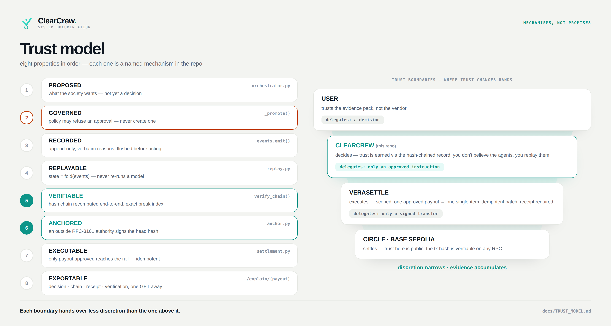
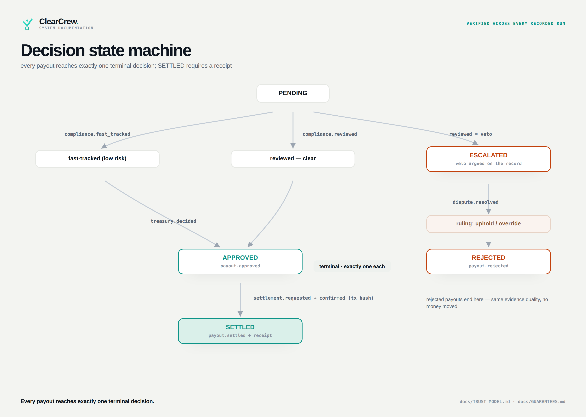

# Trust Model



## The chain of custody for a decision

Every payout decision passes through eight properties, in order. Each one is a
mechanism in this repo, not a promise:

```text
 PROPOSED        five specialist agents argue; the orchestrator records what
    │            the society WANTS to do — not yet a decision  (orchestrator.py)
    ▼
 GOVERNED        the deterministic policy layer promotes the proposal, or
    │            refuses it. An approval that P1/P2/P3 forbid cannot become a
    │            terminal decision — the attempt is recorded as policy.blocked.
    │            Veto-only: it can refuse, never approve.      (_promote, policy.py)
    ▼
 RECORDED        append-only JSONL, one event per judgment,
    │            verbatim reasons, no paraphrase               (events.py: emit)
    ▼
 REPLAYABLE      state = fold(events); the UI replays the
    │            recorded trace — it never re-runs a model     (replay.py)
    ▼
 VERIFIABLE      sha256 hash chain: every event commits to its
    │            predecessor; verify_chain recomputes all of it
    │            and reports the exact break index             (events.py: verify_chain)
    ▼
 ANCHORED        the head hash is signed by an RFC-3161 authority with its own
    │            key. Hash chaining alone only stops someone who cannot rewrite
    │            the file; this stops someone who can.         (anchor.py)
    ▼
 EXECUTABLE      only payout.approved reaches the rail; one
    │            single-item batch per payout, idempotent      (settlement.py)
    ▼
 EXPORTABLE      the whole trail — decision, chain, receipt,
                 verification — is one GET away                (/api/runs/{run}/explain/{payout})
```

Tamper with any earlier event — a reason, an amount, a verdict — and the chain
breaks at that index. Rewrite the whole chain to hide it, and the recomputed
head no longer matches the one a third party signed. The tx hash is checkable
on any Base Sepolia RPC.

**Why GOVERNED sits second.** It used to sit nowhere: the policy layer graded
decisions after the fact, and two archived runs recorded approvals that overdrew
the treasury. Grading tells you that you lost money. A gate means the loss was
never expressible. For a trust product, an invariant beats a benchmark.

## Trust boundaries — where trust changes hands

```text
┌─────────────────────────────────────────────────────────────────────┐
│  USER                                                               │
│  trusts: the evidence pack, not the vendor                          │
╞═════════════════════════════════════════════════════════════════════╡
│  CLEARCREW  (this repo)                                             │
│  decides. trust is *earned* here via the hash-chained record:       │
│  you don't have to believe the agents — you can replay them         │
╞═════════════════════════════════════════════════════════════════════╡
│  VERASETTLE  (external, non-custodial payout orchestrator)          │
│  executes. trust handed over is *scoped*: one approved payout →     │
│  one single-item batch, idempotent, receipt required back           │
╞═════════════════════════════════════════════════════════════════════╡
│  CIRCLE STACK / BASE SEPOLIA                                        │
│  settles. trust here is *public*: the tx hash in the receipt is     │
│  verifiable on any RPC — nobody in the stack can fake it            │
└─────────────────────────────────────────────────────────────────────┘
```

Each boundary hands over **less** discretion than the one above it: the user
delegates a decision, ClearCrew delegates only an approved instruction,
Verasettle delegates only a signed transfer. Discretion narrows; evidence
accumulates.

## Decision state machine



Every payout reaches exactly one terminal decision; `SETTLED` is the only
state after approval, and it must carry a receipt.

```text
                    ┌──────────┐
                    │ PENDING  │
                    └────┬─────┘
             ┌───────────┼───────────────┐
             ▼           ▼               ▼
        fast-tracked  reviewed      VETOED (compliance)
             │           │               │ dispute argued on the record
             │           │               ▼
             │           │          ESCALATED → dispute.resolved (ruling)
             │           │               │
             └─────┬─────┴───────────────┘
                   ▼
          ┌────────┴────────┐
          ▼                 ▼
     ┌──────────┐     ┌──────────┐
     │ APPROVED │     │ REJECTED │        ← terminal decision (exactly one)
     └────┬─────┘     └──────────┘
          │ settlement.requested → settlement.confirmed (receipt + tx hash)
          ▼
     ┌──────────┐
     │ SETTLED  │
     └──────────┘
```
